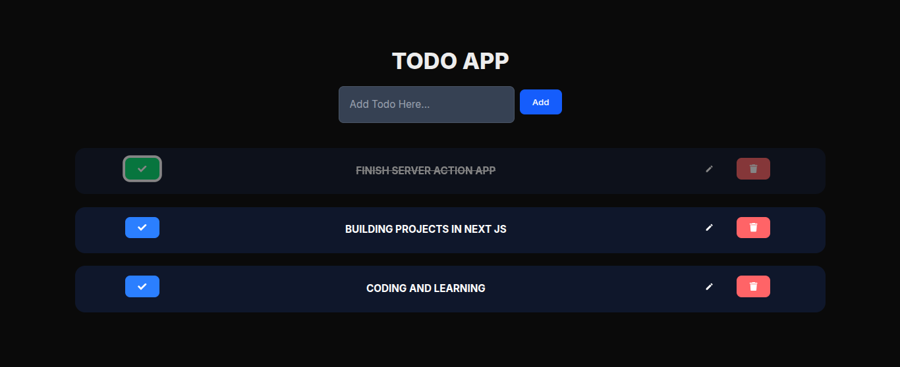

# Todo App

Stay organized and boost productivity with a modern task management application built using Next.js, TypeScript, Prisma, and MongoDB.

Designed with scalability, performance, and developer experience in mind, this project demonstrates modern full-stack development practices, including authentication, database management, protected routes, and responsive UI design.

## ✨ Core Features

* ✅ Secure Authentication
* ✅ Create, Update & Delete Tasks
* ✅ Task Completion Tracking
* ✅ Responsive User Interface
* ✅ MongoDB Persistence
* ✅ Prisma ORM Integration
* ✅ Type-Safe Architecture with TypeScript

## 🛠️ Tech Stack

### Frontend

* Next.js
* React
* TypeScript
* Tailwind CSS

### Backend

* Next.js Server Actions / API Routes
* Prisma ORM

### Database

* MongoDB

### Authentication

* Auth.js (NextAuth)

## 📸 Screenshots

<p align="center">
  
</p>

> Create a `screenshots` folder in the project root and place your images there.

## 🚀 Getting Started

### Prerequisites

Make sure you have installed:

* Node.js 18+
* pnpm (recommended)
* MongoDB database

### Installation

Clone the repository:

```bash
git clone git@github.com:TimothyAttah/todos-app.git
```

Navigate to the project directory:

```bash
cd todos-app
```

Install dependencies:

```bash
pnpm install
```

### Environment Variables

Create a `.env` file in the root directory:

```env
DATABASE_URL="your_mongodb_connection_string"

AUTH_SECRET="your_auth_secret"

GOOGLE_CLIENT_ID="your_google_client_id"
GOOGLE_CLIENT_SECRET="your_google_client_secret"
```

### Prisma Setup

Generate Prisma Client:

```bash
npx prisma generate
```

Push the schema to MongoDB:

```bash
npx prisma db push
```

### Run the Development Server

```bash
pnpm dev
```

Open:

```text
http://localhost:3000
```

## 📂 Project Structure

```text
src/
├── app/
├── components/
├── actions/
├── hooks/
├── lib/
├── prisma/
└── types/
```

## 🌐 Deployment

This application can be deployed on Vercel with MongoDB Atlas as the database provider.

## 📄 License

This project is licensed under the MIT License.

## 👨‍💻 Author

Built by Timothy Attah using Next.js, TypeScript, Prisma, and MongoDB.
